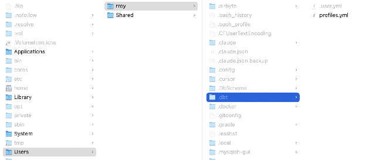

1. Once the dbt installation is complete, go to your file explorer and open your user folder.  
2. Unhide all folders if needed. On macOS, use `Cmd + Shift + .`.  
3. Open the `.dbt` folder. If it does not exist, create it.  
4. Inside that folder, create a new file called `profiles.yml`.  
   
5. Add a profile like the following, replacing the placeholders with the values for your environment:

```yaml
dbt_<org_name>:
  outputs:
    prod:
      dbname: <db_name>
      host: localhost
      pass: <password>
      port: 5432
      schema: prod
      threads: 4
      type: postgres
      user: <username>
    dev:
      dbname: <db_name>
      host: localhost
      pass: <password>
      port: 5432
      schema: dev
      threads: 4
      type: postgres
      user: <username>
  target: dev
```

You can find the credential values inside your Vaultwarden vault. Log in to Vaultwarden as described in the next section.

If your environment does not use a local tunnel or port-forwarding workflow, replace `localhost` with the actual warehouse host provided for your project.
