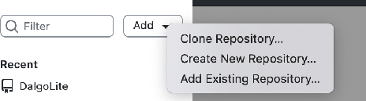
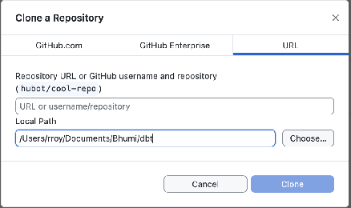

## Option 1 \- GitHub Desktop

**Dalgo stores dbt code in GitHub so that there is one central, shared place where the latest version of the project is maintained.** This makes it easier for teams to collaborate, track what has changed over time, and avoid passing code back and forth through email or chat. Even if you are not writing code yourself, having access to the repository can help you review files, understand project structure, and keep a local copy of the latest dbt project on your machine. In this section, we use GitHub Desktop as a simple visual tool to download the repository, make updates locally, and sync changes back to GitHub.

1. Your dbt project code lives in a shared GitHub repository.  
2. Ask Dalgo for the correct repository URL for your organisation.  
3. To sync the remote repository to your local machine, we will use GitHub Desktop.  
4. Download and setup your relevant version from here: [https://desktop.github.com/download/](https://desktop.github.com/download/)  
5. Go to Add-\>Clone Repository  
     
6. To to URL-\>Paste your repository link. Then, create a new folder inside your ‘Documents’ folder from File Explorer. Then, select that local location here under ‘Local Path’  
     
7. This will set up a local copy of your repository. You can make changes to this local copy locally and once done, you can commit and push changes into the original remote repository.  
     
   

## Option 2 - GitHub with VS Code and Git

**Dalgo stores dbt code in GitHub as the central source of truth for the project.** In simple terms, GitHub is where the project files live, where changes are tracked, and where teams can work on the same codebase in an organised way. This helps ensure that everyone is working from the latest version, that past changes can be reviewed if needed, and that important project files are not shared informally through email, chat, or other messaging platforms. You can access and sync this repository using a range of tools, depending on what is most comfortable for your team.

1. Install **Git** on your machine.

2. Install and open **Visual Studio Code**. VS Code’s Source Control features work with your local Git installation. 

3. Open your organisation’s GitHub repository in the browser using the URL provided by Dalgo.

4. On the repository page, click **Code** and copy the **HTTPS** repository URL. GitHub provides clone URLs from the **Code** menu on the repository page. 

5. In VS Code, open the **Source Control** view and click **Clone Repository**.

6. Paste the repository URL.

7. Choose a **parent folder** on your machine where the repository should be saved, for example inside your **Documents** folder. VS Code will create the local repository folder there. 

8. Open the cloned repository when prompted. Once opened, VS Code will detect it as a Git repository automatically. 

9. Make your changes to the dbt project files locally.

10. Open the **Source Control** view to review your changes.

11. Stage the files you want to include, enter a commit message, and commit the changes. VS Code supports staging and committing directly from the Source Control interface. 

12. Use **Sync**, **Push**, or the Source Control actions menu to send your committed changes back to GitHub. When your local branch is connected to the remote branch, VS Code shows sync status in the interface. 

### **Notes**

* This process gives you a **local copy** of the shared dbt repository on your machine.

* You can edit files locally first, then **commit** your changes, and then **push** them back to the shared GitHub repository.

* If you do not yet have access to the repository, please contact **Dalgo Support** so the required GitHub access can be granted.
