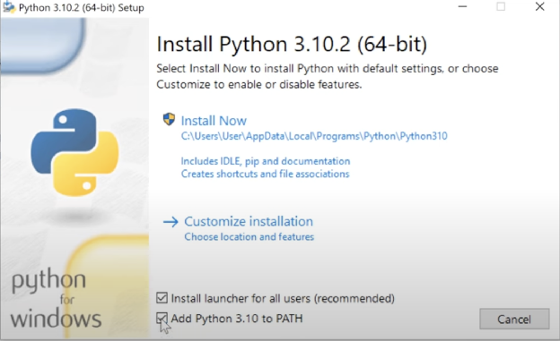

1. Set up an IDE(i.e. code editor) of your choice.   
2. If you want to use an AI enabled editor, we recommend Cursor or Windsurf (see AI Assistants Section)  
3. Another recommended IDE is Visual Studio Code 2 \- [https://code.visualstudio.com/download](https://code.visualstudio.com/download)  
4. Use the download link above to download and install the version for your ecosystem (linux/windows/macos)  
5. We need python to run DBT. To check python version installation on your local machine, run the following command in the terminal: python3 \--version  
6. If you see a python version then you can proceed. But if not installed is shown then you need to install python first. Download & setup: [https://www.python.org/downloads/](https://www.python.org/downloads/)  
7. Mark the checkboxes as shown & click ‘Install Now’ (for easiest installation)  
     
     
   For detailed installation guide follow this tutorial: [How To Install Python In 3 Minutes (For Beginners)](https://www.youtube.com/watch?v=8cAEH1i_5s0)
