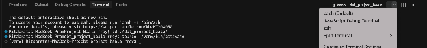
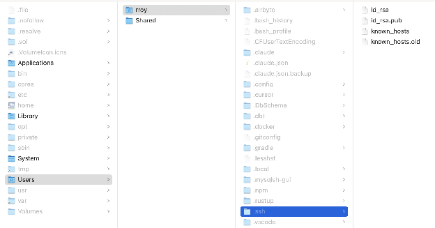

1. Inside your IDE, open a new terminal.  
2. Inside the terminal, towards the top right corner, you will see a dropdown arrow. Clicking it reveals the different types of terminals we can open. Select the ‘bash’ option from here.  
     
3. Go to the newly opened ‘bash’ terminal  
4. Type this command and run after putting in your email :   
   ssh-keygen \-t rsa \-b 4096 \-C "\<your email address\>"  
5. Keep pressing enter in response to the prompts on the screen  
6. Once the process is complete, Go to your file explorer & go to ‘Users’-\>’your\_username\_folder’   
7. Unhide all folders (on mac: cmd+shift+.)  
8. Open the ‘.ssh’ folder. You should atleast see two files ‘id\_rsa’ & ‘id\_rsa.pub’  
     
9. ‘id\_rsa’ is your private security key & ‘id\_rsa.pub’ is your public identification key. Keep both of them safe.  
10. Contact your Dalgo PoC and share with them your public key (i.e. the ‘id\_rsa.pub’ file). They will put your public key on the jump server so that you can securely connect to it from your local machine.   
11. Once your key has been put on the server, the PoC will let you know.
