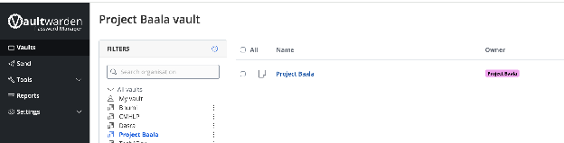

Dalgo uses Vaultwarden as the central, secure place to store and share sensitive credentials across teams and client projects. This includes items such as data warehouse/database credentials, SSH keys, API keys, and other access details required for implementation, maintenance, and support.

All credentials should be stored and accessed through Vaultwarden rather than shared over informal channels like chat, WhatsApp, Discord, email threads, or support messages. This helps keep sensitive information secure, ensures the latest credentials are easy to find, and makes access management more organized and reliable.

1. Contact Dalgo Support and request access to Vaultwarden.  
2. Dalgo Support will send you an invitation to join.  
3. Open the invitation and create your Vaultwarden account by setting up your login credentials.  
4. Once your account has been created, accept the invitation to join the organisation.  
5. Dalgo Support will then complete the final approval from our side, if required.  
6. After that, log in to Vaultwarden here: [https://vaultwarden.projecttech4dev.org/\#/login](https://vaultwarden.projecttech4dev.org/#/login)  
7. In the left menu under **All Vaults**, go to your organisation vault: **\<Org\_Name\>**  
8. **\<Org\_Name\>** contains your organisation’s data warehouse/database credentials and other shared access information.

