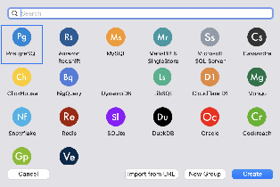
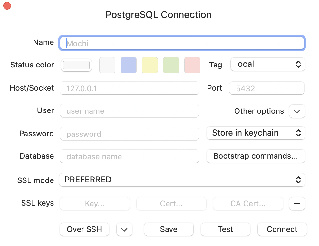
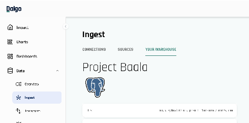

In some cases, you may need direct access to your data warehouse from your own machine. This is useful for inspecting tables directly, checking whether data is ready for charting, validating transformed outputs, and reviewing dbt model logic to confirm that the data pipeline is behaving as expected.

Direct database access is especially helpful during implementation, QA, troubleshooting, and dashboard preparation, where it is often easier to verify the underlying tables than to rely only on the application UI.

**Choosing a Database Client**

To connect to your warehouse locally, you will need a database client application.

Dalgo consultants commonly use **TablePlus** because it is fast and simple for day-to-day warehouse inspection. TablePlus supports PostgreSQL and other relational databases. It can be used for free, but the vendor states that the free version is limited to **2 active tabs, 2 active windows, and 2 advanced filters at a time**; on the free Windows version, advanced filters are not available. 

You may also use other database clients if you prefer. Two common alternatives are:

* **DBeaver Community**: a free, open-source, cross-platform database client. DBeaver also has commercial Pro editions for teams or more advanced use cases.   
* **pgAdmin**: a free, open-source administration and development tool focused on PostgreSQL, available across desktop platforms and also deployable as a web application. 

The exact pricing, licensing, and feature tiers for these tools can change over time, so it is best to confirm the latest details on each vendor’s official site before standardising on one tool. The important point is that **the warehouse connection process remains broadly the same across clients**: you will still need the same host, database, username, password, and any relevant port or SSL settings.  

**Connecting to TablePlus**

1. Install your preferred database client on your machine.  
    Dalgo consultants typically use **TablePlus**, but **DBeaver** or **pgAdmin** are also valid options.

2. Go to [https://tableplus.com/download/](https://tableplus.com/download/)  Download and set up the relevant version on your machine.  
3. Open the application. Click on ‘Create Connection’  
     
 

   

4. If you are using a Postgres Data Warehouse (if set up by Dalgo) then click on ‘Postgres’. Then click ‘Create’. Otherwise set up your own data warehouse.  
     
     
5. This popup box opens up. To find the details to fill in here, follow next steps  
     
6. Now, Open your org’s Dalgo platform. Go to **Data-\>Ingest-\>Your Warehouse**  
     
     
     
7. From here copy the required data and past in the TablePlus pop-up window in step 5  
* Name: \<Org Name\> Data Warehouse  
* Tag: Production  
* Host: \<’Host’ from Dalgo page\>  
* User: \<’User’ from Dalgo page\>  
* Password: \<Get from Vaultwarden \- Your Org’s vault\>  
* Database: \<’Database’ from Dalgo page\>  
    
8. If your client asks for SSL or additional connection settings, use the values provided in your warehouse details or credentials store.

9. Test the connection and save it.

​​Once connected, you will be able to browse schemas and tables locally, inspect records, run validation queries, and verify whether the warehouse data is ready for downstream reporting and dashboarding.
