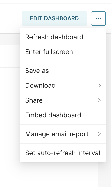

This document explains how to embed a Superset dashboard into a website using a **Guest Token** together with Superset authentication, a CSRF token, and any Row-Level Security (RLS) rules required for the embedded view.

The important implementation rule is this: **run the authentication and token-generation requests on your backend, not in browser-side code.** Do not expose a Superset username, password, or long-lived service credential in frontend JavaScript.

## Pre-requisites

1. **Superset setup**  
   - A Superset instance with dashboards and datasets configured.  
   - RLS policies applied to the datasets as required.
2. **Authentication details**  
   - A valid Superset service account or other approved account with access to the dashboard.
3. **API access**  
   - The Superset API endpoints must be reachable from the backend that will request tokens.
4. **Web development knowledge**  
   - Familiarity with HTML, JavaScript, and API integration.

## Steps to embed the dashboard

### Step 1: Authenticate and get an access token

Use the Superset API to log in and retrieve an access token.

**Login endpoint**

Make a `POST` request to `/api/v1/security/login` with your Superset credentials.

```javascript
async function getAccessToken(username, password) {
  const loginUrl = 'https://superset.example.com/api/v1/security/login';

  const response = await fetch(loginUrl, {
    method: 'POST',
    headers: {
      'Content-Type': 'application/json',
    },
    body: JSON.stringify({
      username,
      password,
      provider: 'db',
      refresh: true,
    }),
  });

  if (!response.ok) {
    throw new Error('Login failed');
  }

  const data = await response.json();
  return data.access_token;
}
```

### Step 2: Get the CSRF token

Make a `GET` request to `/api/v1/security/csrf_token` using the access token.

```javascript
async function getCSRFToken(accessToken) {
  const csrfTokenUrl = 'https://superset.example.com/api/v1/security/csrf_token';

  const response = await fetch(csrfTokenUrl, {
    method: 'GET',
    headers: {
      'Content-Type': 'application/json',
      Authorization: `Bearer ${accessToken}`,
    },
  });

  if (!response.ok) {
    throw new Error('Token fetch failed');
  }

  const data = await response.json();
  return data.result;
}
```

### Step 3: Get the guest token

Once you have the access token and CSRF token, make a `POST` request to `/api/v1/security/guest_token/`.

Include the user context, dashboard resource, and any RLS rules required for the embedded view.

```javascript
async function generateGuestToken(accessToken, csrfToken, username, dashboardId, rlsClause) {
  const guestTokenUrl = 'https://superset.example.com/api/v1/security/guest_token/';

  const payload = {
    user: { username },
    resources: [
      {
        type: 'dashboard',
        id: dashboardId,
      },
    ],
    rls: [
      {
        dataset: 'DATASET_NAME',
        clause: rlsClause,
      },
    ],
  };

  const response = await fetch(guestTokenUrl, {
    method: 'POST',
    headers: {
      'Content-Type': 'application/json',
      'X-CSRFToken': csrfToken,
      Authorization: `Bearer ${accessToken}`,
    },
    body: JSON.stringify(payload),
  });

  if (!response.ok) {
    throw new Error('Guest token generation failed');
  }

  const data = await response.json();
  return data.token;
}
```

### Step 4: Embed the dashboard

Once you have the guest token, you can use it with the [Superset Embedded SDK](https://www.npmjs.com/package/@superset-ui/embedded-sdk) in your web application.

Things required in the SDK:

- `id` — copy the dashboard id from the embed dashboard flow in Superset  
  
- `fetchGuestToken` — implement this using your backend endpoint that runs the steps above

## Implementation note

The API requests shown in this guide should live on a backend service. Your frontend should call your own backend endpoint and receive only the short-lived guest token needed by the Embedded SDK.
