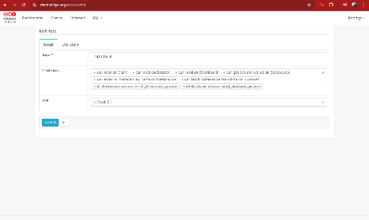
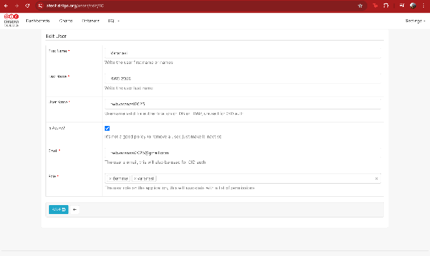
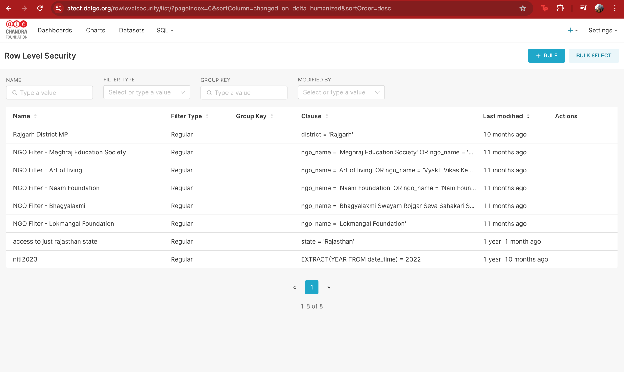
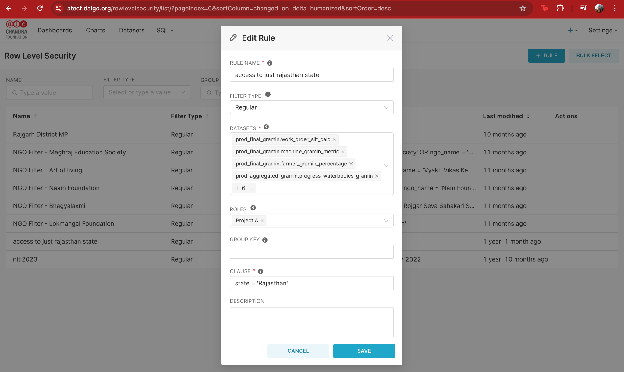
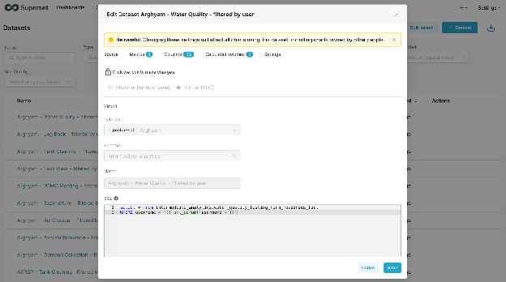
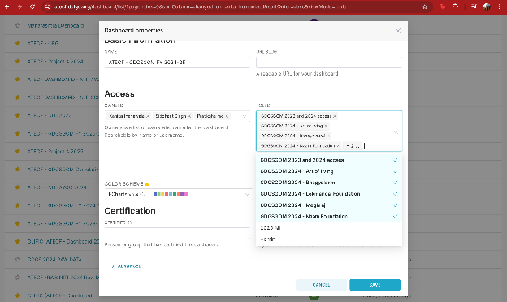
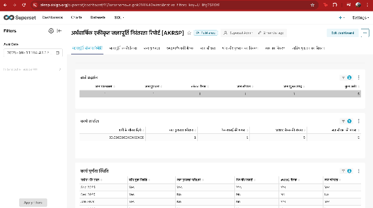

## 1 \- What is Row Level Security?

Row Level Security (RLS) ensures that each user only sees the rows of data they are allowed to see, even if they are viewing the same chart or dashboard as other users.  
In Superset, RLS works by attaching a SQL filter clause (e.g., district \= 'Rajgarh') to a dataset. Whenever Superset queries that dataset, it automatically appends the RLS clause so restricted rows never appear in results.

## 2 \- Two ways we implement RLS

We use **two common methods**, depending on whether dashboards are **logged-in** or **publicly shared**.

### Method A — RLS using Superset login username (recommended for logged-in dashboards)

This method relies on the user being authenticated in Superset, and uses their **Superset username** to filter data.

**Use case:**

* Dashboards where users log in with their own Superset account  
* Stronger access control (the identity comes from the authenticated Superset user session).

### Method B — RLS using an external username passed via URL (for public dashboards)

This method works when dashboards are shared publicly and the viewer is not logging in. In this case, we pass a username in the URL, and the dataset contains a mapping of allowed external usernames.  
Use case:

* Public dashboard links (no Superset login)  
* Per-user views controlled by URL parameters

⚠️ Important note: URL-based “identity” is only as secure as link sharing. If someone shares a link with another person, that person can see the same scoped data. For sensitive use cases, we recommend authenticated access (Method A) or a more secure embedding approach (guest token / signed claims) if you use Superset Embedded.

## 3 \- Core Superset objects and how they connect

To understand RLS, it helps to know how these pieces connect:

### (1) Users

A **User** is an account that logs into Superset.

### (2) Roles

A **Role** is a named bundle of permissions and access. Users are assigned roles.

Typical pattern we use:

* A “base” role like Gamma (basic viewing ability)

* A “client role” like ***‘Government Official \- Maharashtra’*** (specific access \+ RLS attachment)

### (3) Datasets

A **Dataset** is the table/query Superset reads from (physical table or virtual dataset).

### (4) RLS Rules

An **RLS Rule** attaches a filter clause to:

* one or more **datasets**

* one or more **roles**

Meaning: *Anyone with that role gets those filters applied on those datasets.*

### (5) Dashboards

A **Dashboard** is a collection of charts. Dashboards can also be configured with which roles can access them.

## 4 \-  Method A — RLS using Superset login username (authenticated users)

### 4.1 Step-by-step setup in Superset

**Step 1 — Create / update the client Role**

Go to: **Settings → List Roles → \+ Role**

Add permissions like:

* can read on Dashboard  
* can read on Chart  
* can read on Dataset  
* can get column values on Datasource  
* datasource access on the relevant warehouse/datasource

**Roles**



**Step 2 — Assign the client role to the client’s Superset user**

Go to: **Settings → List Users → select user → Edit**

Assign:

* Gamma (optional base role)  
* the client-specific role (e.g., GDGSGOM 2024 \- Meghraj)

**Users**



**Step 3 \- Create an RLS rule linked to that role**

Go to: **Settings → Row Level Security → \+ Rule**

Fill:

* **Rule Name:** clear label (e.g., NGO Filter \- Meghraj Education Society)  
* **Filter Type:** Regular  
* **Datasets:** select *all datasets used by the dashboards that should be restricted*  
* **Roles:** select the client role  
* **Clause:** the SQL predicate that restricts rows

**Row Level Security rules list**



### 4.2 How to write the RLS Clause

There are two common data designs:

#### Option A1 (simplest): The dataset already has a username column which matches the superset username

Example RLS clause:

* `username = '{{ current_username() }}'`

#### Option A2 (more common): Dataset does NOT have a username column

If the dataset doesn’t store the Superset username directly, we implement RLS by filtering using a **business key** (e.g., ngo\_name, district, state, project\_id) and mapping **users → allowed business keys**.

There are two common ways to do this:

##### A2.1 User-to-key mapping (per-user access)

Maintain a mapping table (or view) such as user\_access\_map:

* username (Superset login username)

* allowed\_key (e.g., ngo\_name or district)

Then the RLS clause checks whether the row’s business key is in the user’s allowed list:

* **Example (NGO-based):**

   `ngo_name IN (SELECT ngo_name FROM user_access_map WHERE username = '{{ current_username() }}')`

* **Example (District-based):**

   `district IN (SELECT district FROM user_access_map WHERE username = '{{ current_username() }}')`

This lets you onboard a new user by simply adding rows into the mapping table—no dashboard/chart changes needed.

##### A2.2 Role-to-key mapping (area/team-based access)

Instead of maintaining mappings per user, you can create **area-based roles** and assign them to all users from that area (e.g., “District – Rajgarh”, “State – Rajasthan”, “NGO – Meghraj”).

In this setup:

* One role represents one scope (area/NGO/team/etc.)

* An RLS rule is created **per role** with a fixed clause, e.g.:

   district \= 'Rajgarh'

   or

   ngo\_name \= 'SHOFCO'

**Why this is useful:**

* Easier to manage when multiple people share the same access scope  
* Adding/removing access is as simple as assigning/unassigning a role to a user

**Tradeoff:**

* If you have hundreds of unique scopes, you may end up with many roles/RLS rules. In that case, the mapping-table approach can scale better.

#### **4.3 Example clauses (authenticated)**

These examples assume the dataset has a relevant column:

* **District-based access:**

   district \= 'Rajgarh'

* **State-based access:**

   state \= 'Rajasthan'

* **NGO-based access:**

   ngo\_name \= 'SHOFCO'

* **Username-based access (if dataset has username column):**

   `superset_username = '{{ current_username() }}'`

**“Edit Rule”** 



## 5 \- Method B — RLS using external usernames passed via URL (public dashboards)

### 5.1 What this looks like (high-level)

When a dashboard is publicly shared,  the viewer is typically not logged in as a unique Superset user. So we cannot rely on current\_username().

Instead:

1. The dataset contains a “who can see this row” field (commonly a JSON blob or array of allowed usernames from another platform).  
2. The dashboard link includes a query parameter like ?username=some\_user.  
3. The RLS rule reads that URL parameter and filters rows accordingly.

Example public URL:

```
https://YOURDOMAIN.dalgo.org/dashboard/11/?username=name%40org&native_filters_key=...
```

Here:

* username=name214%40org means the username is name@org (@ is URL-encoded as %40).

---

### 5.2 Implementing Method B (public dashboards)

#### Virtual Dataset filtering using url\_param('username')

Instead of using RLS rules, we can create a **Virtual Dataset (SQL)** that **filters the dataset itself** based on a username passed in the URL.

**Best when:**

* Your base table already contains a username column (or any external identifier column), OR  
* You’re okay joining to a mapping table inside the dataset SQL.

**Example Virtual Dataset SQL (simple case):**

```
SELECT *
FROM intermediate_analytics.water_quality_testing_form_responses_fact
WHERE username = '{{ url_param('username') }}'
```

**If the base table does NOT have username** (mapping-table approach inside the dataset):

```
SELECT f.*
FROM some_fact_table f
JOIN user_access_map m
  ON f.ngo_name = m.ngo_name
WHERE m.username = '{{ url_param('username') }}'
```

**Important notes:**

* This approach can be easier operationally for public dashboards because it avoids role/RLS rule complexity.  
* Only charts built on this **filtered virtual dataset** will be restricted — so we must ensure dashboards don’t accidentally use the unfiltered physical dataset.  
* Superset warns that editing a dataset affects all charts using it — so we typically create a **new dataset copy** like “\<Project\> – \<Table\> – filtered by user”.

**Virtual Dataset Configuration**  
  
---

## 6 \- Access Enforcement

### 6.1 Flow for Method A (logged-in users)

1. **Create/assign Role** to the user (e.g., Government Official \- Maharashtra).  
2. **Grant dashboard access** to that Role (Dashboard → Properties → Access → Roles).  
3. **Attach RLS rules** to that Role for *all datasets used in the dashboard* (Settings → Row Level Security).  
4. When the user opens the dashboard:  
   * Superset checks they have dashboard access via Role  
   * Superset queries datasets  
   * RLS filters are automatically applied → user only sees permitted rows

If a dataset used by the dashboard is not included in the RLS rule, it may leak unrestricted data.

#### **Dashboard Roles vs Dataset permissions vs RLS**

* **Dashboard Roles** decide who can *open the dashboard*.  
* **Dataset permissions** decide who can *query datasets* (sometimes bypassed if dashboard role access is granted depending on Superset configuration).  
* **RLS Rules** decide which *rows* a role can see when datasets are queried.

Best practice we follow:

1. Restrict dashboard access to the client role  
2. Apply RLS rules to that client role  
3. Ensure all datasets used by the dashboard are included in the RLS rule(s)

**Dashboard Roles**



### 6.2 Flow for Method B (public dashboard with username in URL \+ virtual dataset)

1. Create a **Virtual Dataset** that filters using `{{ url_param('username') }}`.  
2. Build charts using **only that virtual dataset** (not the unfiltered base dataset).  
3. Share public URL like: ...?username=name%40org...  
4. When anyone opens the link:  
   * Superset reads the URL parameter  
   * The virtual dataset SQL applies the filter  
   * Viewer only sees rows matching that username  
   * If a chart accidentally uses the *unfiltered* dataset, it will show broader data.  
   * If the username parameter is missing/invalid, you should default to **no rows** (preferred).

**URL to a public dashboard**



---
