## User Management

### Adding New Users

1. Have users log into Superset using the sign-in method configured for your deployment, such as Google Sign-In or another SSO provider.  
   1. Superset may initially assign them a limited role such as `Gamma`, which usually will not give them access to the dashboards they need.  
   2. If the username is generated by your identity provider, do not change it unless you are certain your authentication setup allows that change. In many deployments, changing the provider-generated username can prevent future sign-in.  
2. An Admin will then need to manually assign the correct role. Navigate to **Settings** \> **List Users**.

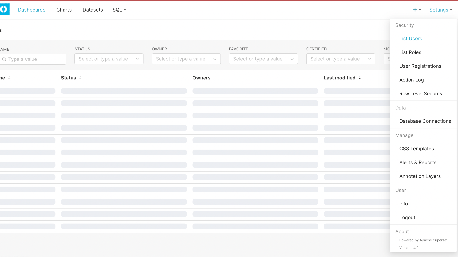

3. You should be able to see users who have logged in through your configured authentication provider. New users may appear with minimal profile details, a limited default role, and a provider-generated username. **If your SSO configuration depends on that generated username, do not change it without verifying the impact on future sign-in.**  
4. Find the user in the list, and click on **the pencil icon** to edit their record

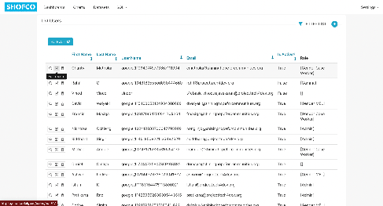

5. Add in the First Name and Last Name of the User.  
6. Ensure the **Is Active** checkbox is ticked  
7. Update role as needed from ‘Gamma’ to whatever the User’s role is supposed to be. Users can hold multiple roles to combine permissions.  
8. Update the blob according to necessary row level security, and if row level security is not needed for their role, leave it blank. (*Row Level Security discussed below*)  
9. **Save** changes.

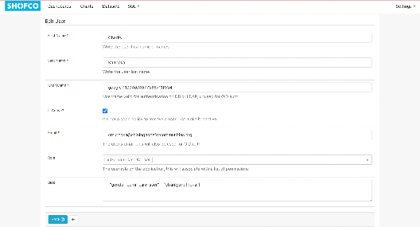

### Deactivating Users

1. Locate the user under **Settings \>** **List Users**.  
2. Select **Edit (the pencil icon)**, then mark the user as inactive by unchecking the **Is Active** checkbox.  
3. Confirm and **Save**.  
   

## Role Management

### Understanding Roles

* Superset uses roles to manage permissions. Roles include built-in ones like **Admin**, **Alpha**, **Gamma**, **Public**, etc.  
* Custom roles can be created for specific user needs or team-based access control.

### Creating a Custom Role

1. Navigate to **Settings** \> **List Roles**.

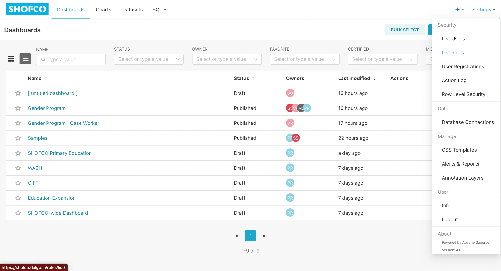

2. Click on the **(+)** icon on the top right to add a new role. 

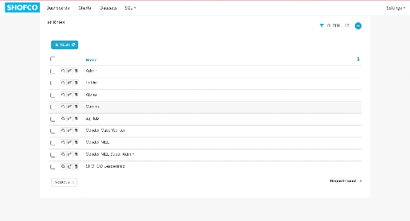

3. Name the role according to its purpose (e.g., “Site Coordinator” or “Education Case Worker”).  
   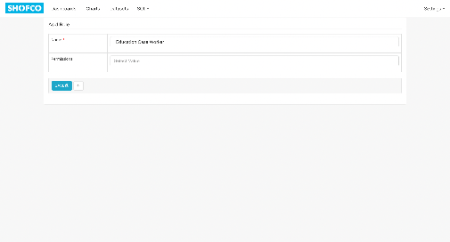  
4. Define permissions by selecting options from the drop down in categories such as **Database Access**, **Dataset Access**, and **Chart Access**.  
   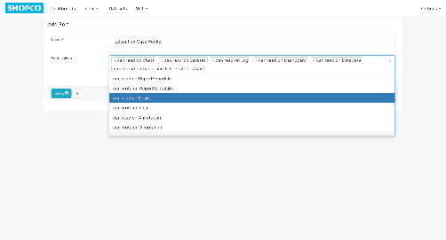  
5. **Save** the new role.

### Assigning Dashboards to Roles

1. Go to the **Dashboards** tab in the top menu

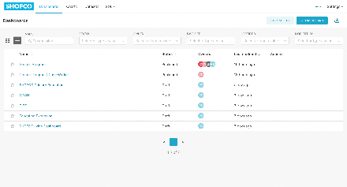

2. Hover over the dashboard you want a role to be able to access, and click on the **Edit (pencil)** icon that shows up

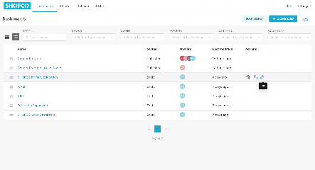

3. In Roles, select the role you want to assign the dashboard to in the dropdown menu

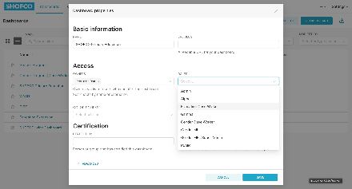

4. Click Save

   

   

   

## Row Level Security

### Activating and Setting up Row level Security

1. Go to **Settings \> Row Level Security** to view, create and edit row level security options

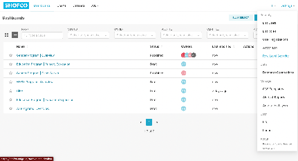

2. Click on the **\+ Rule** button to add a new row-level security rule, or hover over an existing rule and click on the **Edit (pencil icon)** to edit it

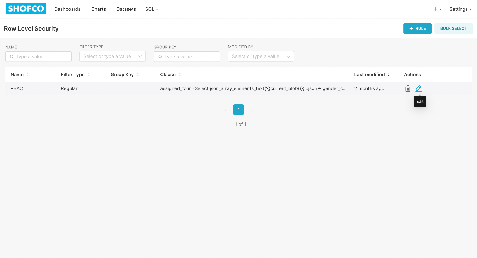

3. Give the role a unique name and fill out the **Clause** textbox with an *SQL* statement that reads the relevant field from a JSON string stored in the user **Blob**.  
   1. For example, the SQL clause below filters the *Gender Program | Case Worker* dashboard so it only shows data for the current case worker:

```sql
assigned_to in (
  select json_array_elements_text('{{current_blob()}}'::json->'gender_commcare_user') as assigned_to
)
```

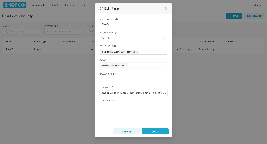

4. Click **Save**

### Filling out the Blob

1. When editing a user, you can fill out the blob with the relevant information for the user, that we have set up row level security to read.  
   1. In the example above, we set up Row Level Security to read the field “gender\_commcare\_user” from the JSON String in the User’s blob  
2. Navigate to **Settings** \> **List Users**.


3. Find the user in the list, and click on **the pencil icon** to edit their record


4. On the Edit User Page, fill out the **Blob** textbox with the JSON string containing the `commcare_id` or any other field you want to filter access by.  
   1. For Case Workers accessing the Gender Program | Case Worker table, we will fill it out as below:

```json
{"gender_commcare_user": ["commcare_id"]}
```


## Best Practices

* **Limit Admin Role**: Restrict the **Admin** role to only those users needing full access and control.  
* **Use Custom Roles**: Create roles aligned with job functions to simplify permission assignments.  
* **Review Periodically**: Periodically review and audit user roles and permissions to maintain security.  
* **Document Changes**: Maintain a log of role assignments and permission changes for accountability.  
* **Avoid Deleting Users:** Deactivate them Instead
