Sign into your AWS console

## Firewall (Security Groups) setup

We will first define a firewall rule so the approved Dalgo or organisation IP allowlist can access the database you are about to create.

[https://console.aws.amazon.com/ec2/home\#CreateSecurityGroup](https://console.aws.amazon.com/ec2/home#CreateSecurityGroup) 

### Basic Details

Start by naming your new security group

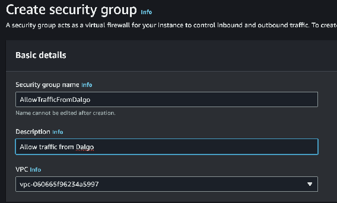

### Inbound rules

Next define inbound rules allowing PostgreSQL traffic on port `5432` from the approved IP allowlist for your environment. If Dalgo or your infrastructure team provides a current allowlist, use that rather than copying old IP addresses from an outdated guide.

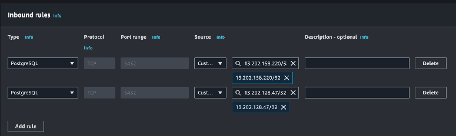

Leave the Outbound rules and Tags as they are and click “Create security group”. Make a note of the name you chose above; we will use it later.

## RDS Setup

Now navigate to RDS  
[https://console.aws.amazon.com/rds/home](https://console.aws.amazon.com/rds/home) 

Look for and click the “Create Database” button

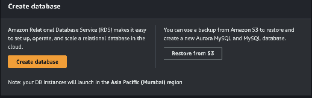

### Engine

Choose Postgres as your engine

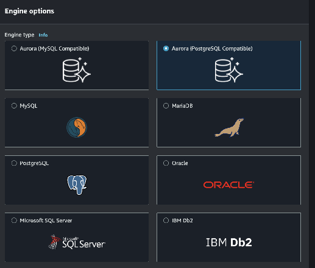

Use a currently supported PostgreSQL version that has been approved for your environment.

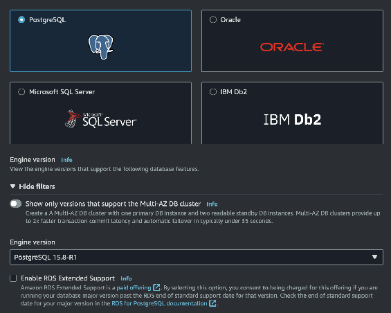

### Templates

Choose the template that matches your environment. For lightweight test setups, a free-tier or similarly small template can be a sensible starting point when available.

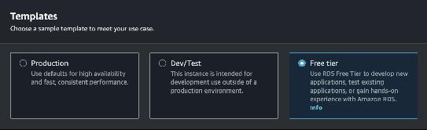

### Availability and Durability

Leave it pre-selected to “Single DB Instance”

### Settings

Under Settings, choose a name for your database instance. Use a master username that fits your team standard, then either set a password yourself or let AWS generate one for you. Store the final credentials in Vaultwarden or your approved secret store.

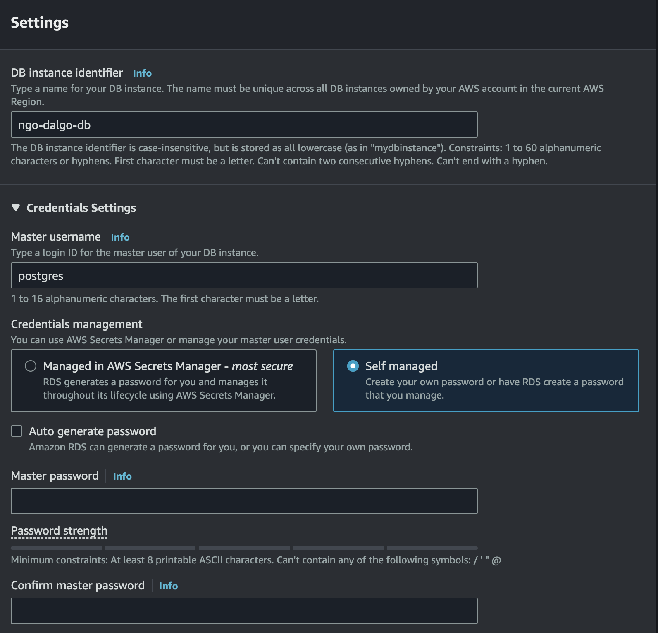

### Instance configuration

Next choose the instance type, including the RAM and CPU allocation for the database instance. Smaller classes can work well for lightweight or test environments, but size this based on your expected workload.

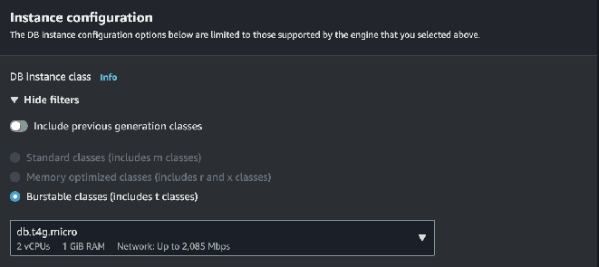

### Storage

Now allocate storage for the database. A smaller starting size can be fine for test environments, but review autoscaling, retention, and cost controls before you create the instance.

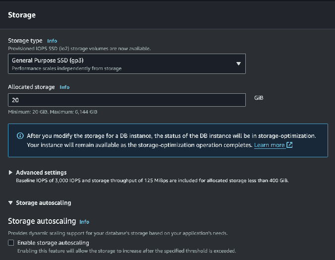

### Connectivity

This is the most complicated section. The first few settings will remain unchanged

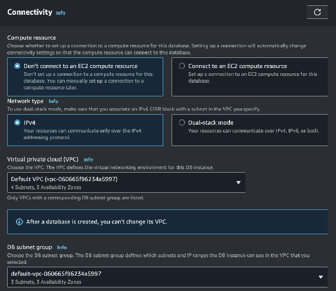

Enable public access only if your access pattern depends on IP allowlisting. If your organisation uses private networking or a bastion flow instead, follow that standard.

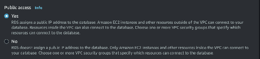

VPC Security groups

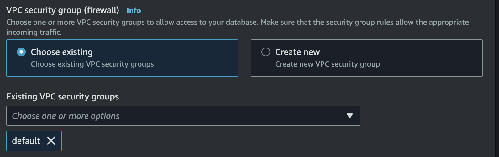

Add the security group created earlier; you will end up with “default” as well as your new security group listed here.

The remaining settings can be left unchanged  
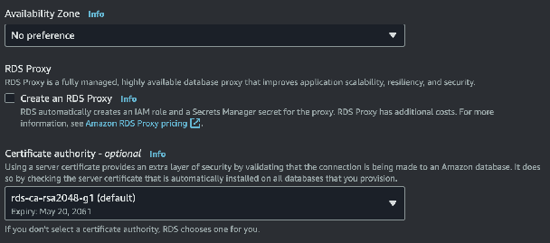

### Tags

Leave unchanged

### Database authentication

Leave set to “Password authentication”

### Monitoring

Review Performance Insights and the rest of the monitoring options based on your support and cost requirements.

### Review and Create

Have a look over your settings and then click the Create Database button

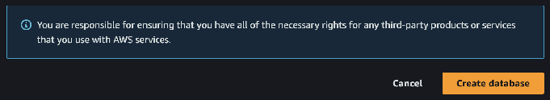
